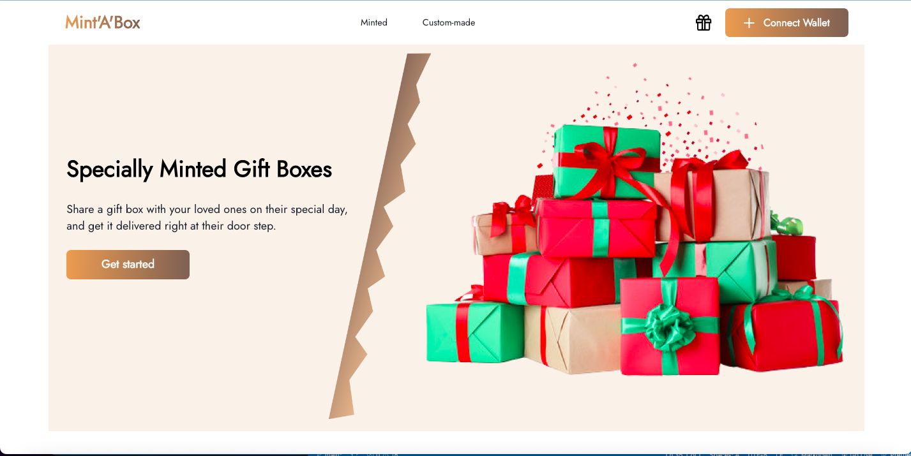
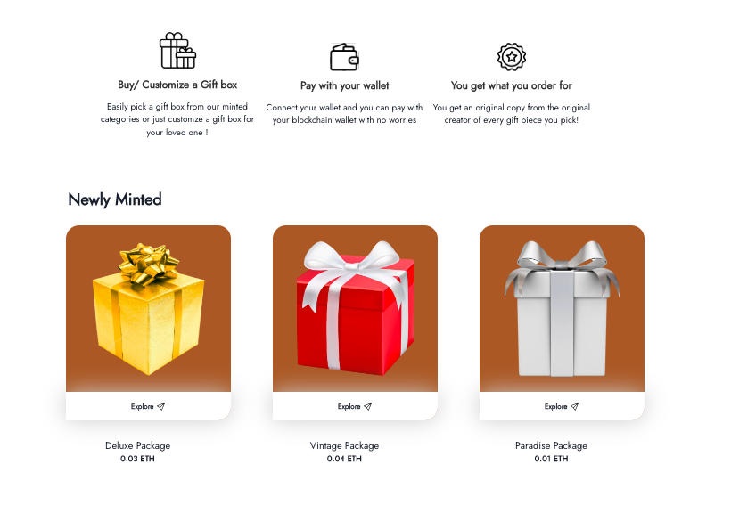
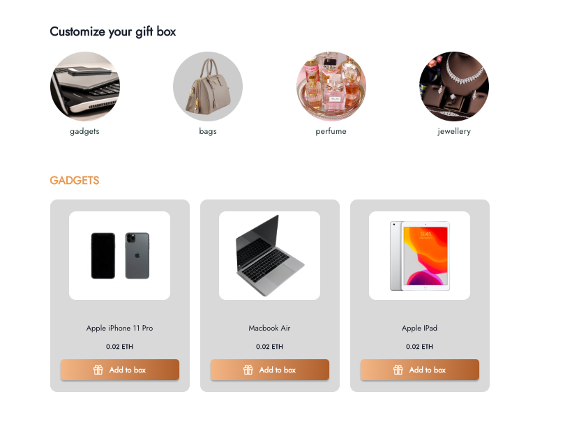

# Mint A Box
MintABox is an NFT e-commerce application that allows its users to curate gift items ranging from gadgets, accessories, jewelleries and other gift items from their original creators while they connect & pay with their metamask wallet to deliver these items directly to the recipients.

### Functions:

- Web3 auth using metamask
- Create & list tokens for sale
- Using IPFS for uploading the file📁
- Buyer can purchase box token or make a customized box token

### Built With

- React-Js
- Chakra UI
- Hardhat
- Solidity

view the deployed project [here](https://mintabox.vercel.app/)

## Getting Started with MintABox Project

### Frontend
Run the following commands in the project directory

- `npm install`
- `npm start`

### Smart Contract
Run the following commands in the project directory

- `npx hardhat node`
- `npx hardhat run scripts/deploy.js`

Runs the app in the development mode.\
Open [http://localhost:3000](http://localhost:3000) to view it in your browser.

## Screenshots of the the project

